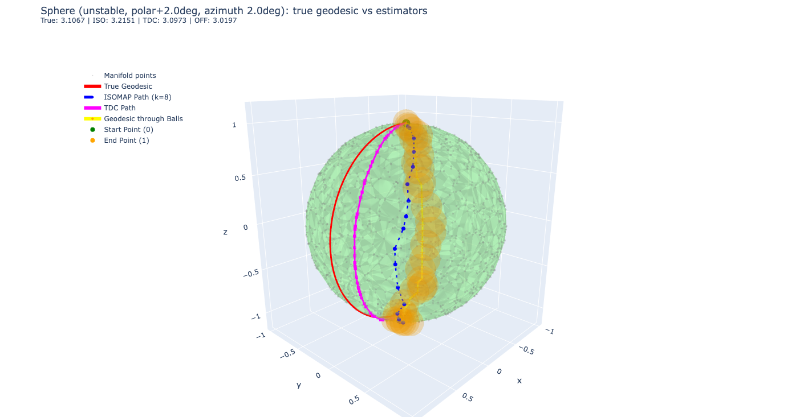
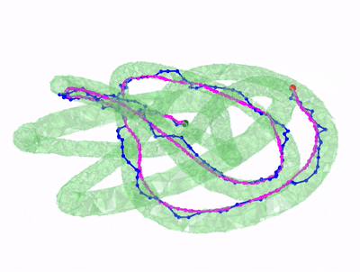

# Minimax Manifold Learning

This repository is a computational study of the paper *Minimax Estimation of Distances on a Surface and Minimax Manifold Learning in the Isometric-to-Convex Setting*. The project focuses on a concrete question:

> Given only sampled points on a smooth manifold, how should one estimate intrinsic geodesic distances?

This work was carried out as an end-of-semester research project for the **Dimension Reduction and Manifold Learning** course taught by **Eddie Aamari** in the **M2 IASD** program. The project authors are **Pierre Cornilleau**, **Abel Douzal**, and **Ruben Ifrah**.

The codebase compares three paradigms:

1. `ISOMAP`: shortest paths on a discrete `k`-nearest-neighbor graph.
2. `TDC`: geodesics on a reconstructed Tangential Delaunay Complex mesh.
3. `Offset`: geodesics inside a thickened volumetric `epsilon`-offset of the point cloud.

The mathematical motivation, also emphasized in the presentation slides, is that graph geodesics are not minimax-optimal in the isometric-to-convex setting, while TDC-based surface geodesics are theoretically consistent with the optimal `O(epsilon^2)` relative distortion regime.




## What This Repository Contains

The repository has two complementary roles:

- a **research codebase** for generating manifolds, reconstructing surfaces, and computing geodesic estimators,
- a **visualization and presentation repository** for explaining the project through notebooks, slides, and exported figures.

The most important files are:

- [src/generate_data.py](/Users/ifrahruben/Desktop/github/Minimax/minimax-manifold-learning/src/generate_data.py): synthetic manifold generation in `R^3` (`sphere`, `torus`, `swiss`, tubular `knot`).
- [src/ISOMAP.py](/Users/ifrahruben/Desktop/github/Minimax/minimax-manifold-learning/src/ISOMAP.py): nearest-neighbor graph construction and shortest-path baseline.
- [src/TDC.py](/Users/ifrahruben/Desktop/github/Minimax/minimax-manifold-learning/src/TDC.py): Tangential Delaunay Complex reconstruction, manifold pruning, and exact polyhedral geodesics.
- [src/offset.py](/Users/ifrahruben/Desktop/github/Minimax/minimax-manifold-learning/src/offset.py): voxelized volumetric offset geodesic approximation.
- [src/geodesic.py](/Users/ifrahruben/Desktop/github/Minimax/minimax-manifold-learning/src/geodesic.py): unified experiment/visualization entry point.
- [notebooks/knot_geodesics.ipynb](/Users/ifrahruben/Desktop/github/Minimax/minimax-manifold-learning/notebooks/knot_geodesics.ipynb): an introductory visualization notebook for the project.
- [notebooks/knot_geodesics_markdown_cells.md](/Users/ifrahruben/Desktop/github/Minimax/minimax-manifold-learning/notebooks/knot_geodesics_markdown_cells.md): polished markdown cells for turning the notebook into a presentation-quality narrative.
- [report - presentation/presentation.pdf](/Users/ifrahruben/Desktop/github/Minimax/minimax-manifold-learning/report%20-%20presentation/presentation.pdf): the slide deck summarizing the theory, implementation choices, experiments, and conclusions.

## Project Structure

The structure of the project mirrors the theory:

### 1. Sample a manifold

Synthetic point clouds are generated on classical smooth manifolds in ambient dimension 3. The repository includes:

- spheres, where the true geodesic is known analytically,
- tori, where curvature changes sign,
- tubular knots, where Euclidean proximity can create graph shortcuts,
- Swiss-roll style examples for visualization and manifold-learning intuition.

### 2. Estimate intrinsic distance

The repository compares three distinct philosophies.

#### Graph method: ISOMAP

The manifold is approximated by a weighted neighborhood graph. Intrinsic distance is then replaced by a graph shortest path. This is fast and easy to compute, but it is vulnerable to short-circuiting when two distant regions of the manifold are close in Euclidean space.

#### Surface method: Tangential Delaunay Complex

The manifold is first reconstructed as a triangulated surface using a Tangential Delaunay Complex. Geodesics are then computed on that reconstructed surface. This is the method most closely aligned with the minimax theory presented in the slides and the original paper.

#### Volumetric method: Offset geodesics

Instead of constraining paths to a zero-thickness surface, the manifold is thickened into a continuous ambient volume. Geodesics are then approximated inside that offset region. This method is motivated by geometric inference and robustness ideas, but is more sensitive to implementation choices such as voxel resolution and offset radius.

### 3. Visualize the resulting paths

The repository is deliberately figure-heavy. A large part of the project is about understanding *why* the estimators differ, not only *how much* they differ numerically.

## Notebook: an Introduction to the Project

The notebook [notebooks/knot_geodesics.ipynb](/Users/ifrahruben/Desktop/github/Minimax/minimax-manifold-learning/notebooks/knot_geodesics.ipynb) should be read as an entry point, not as the full experimental pipeline.

Its role is to:

- introduce the tubular knot geometry,
- show the contrast between a graph geodesic and a mesh geodesic,
- provide an immediate interactive visualization of the core idea behind the project.

In other words, the notebook is primarily a **visualization tool to introduce the project**. The heavier experimentation and the full method implementations live in `src/`.

## Example Figures

### Knot: graph path vs reconstructed-surface geodesic

The knot example is the most intuitive illustration of why graph and surface geodesics can disagree:



On this type of manifold, different branches of the tube can approach each other in ambient space. A discrete graph method can therefore connect nearby samples in `R^3` even when the true geodesic should stay on the same branch of the surface. TDC is designed precisely to avoid this type of shortcut by reconstructing a 2-manifold first.

### Sphere: controlled geodesic comparison

The sphere is useful because it provides an analytical ground truth:


This makes it possible to study not only distance error, but also path stability near difficult regimes such as the pre-antipodal region.

### Torus: the intermediate case


The torus is the most intermediate case, where the graph geodesic is unstable but the mesh geodesic is still well-behaved.

In the example we place the start and end point at cut locus, where the geodesic is unstable. We observe that TDC and Offset take one way around the torus, while ISOMAP takes the other way. 

## Main Visual Outputs

The `images/` directory contains the exported figures produced during the project:

- static PDFs used in the report and slides,
- interactive HTML exports generated with Plotly,
- animated GIFs used for better 3D geometry visualization.


## Installation

Install the Python dependencies with:

```bash
pip install -r requirements.txt
```

Important packages:

- `numpy`, `scipy`, `scikit-learn`
- `gudhi`
- `pygeodesic`
- `matplotlib`, `plotly`
- `kaleido`, `Pillow` for Plotly static export helpers

## Main Script

The main executable script is [src/geodesic.py](/Users/ifrahruben/Desktop/github/Minimax/minimax-manifold-learning/src/geodesic.py).

Typical example:

```bash
python src/geodesic.py --manifold torus --n_points 1500 --points random --k 12 --max_edge 0.5
```

This script can:

- generate a manifold point cloud,
- compute ISOMAP, TDC, and offset geodesic estimates,
- compare them on a shared visualization,
- export static and interactive outputs to `images/`.

Important options:

- `--manifold`: `sphere`, `torus`, `swiss`, `knot`
- `--n_points`: sampling density
- `--k`: neighborhood size for ISOMAP
- `--max_edge`: TDC edge-length control to prevent invalid meshes
- `--method`: `isomap`, `tdc`, `offset`, `all`
- `--plot_engine`: `plotly`, `matplotlib`, `both`
- `--points`: `fixed`, `random`, `unstable`

## Practical Note on TDC

The TDC code is mathematically the most interesting part of the repository, but also the most delicate one in practice.

Two implementation details matter:

1. A tiny jitter is added before calling GUDHI in order to break geometric degeneracies.
2. The reconstructed complex is pruned greedily to enforce a strict 2-manifold before exact geodesics are computed.

If `--max_edge` is too large, GUDHI may create overlapping or topologically invalid triangles. In that case, exact geodesic computation becomes unstable or impossible. This is why tuning `--max_edge` is a central practical parameter in the experiments.

## Presentation Slides

The slide deck [report - presentation/presentation.pdf](/Users/ifrahruben/Desktop/github/Minimax/minimax-manifold-learning/report%20-%20presentation/presentation.pdf) gives the best high-level summary of the project:

- the minimax motivation,
- derivation of the minimax optimal bound,
- why graph distances are not theoretically sufficient,
- why TDC is the central reconstruction tool,
- empirical geodesic comparisons on sphere, torus, and knot,
- the offset-method extension and its limitations.

